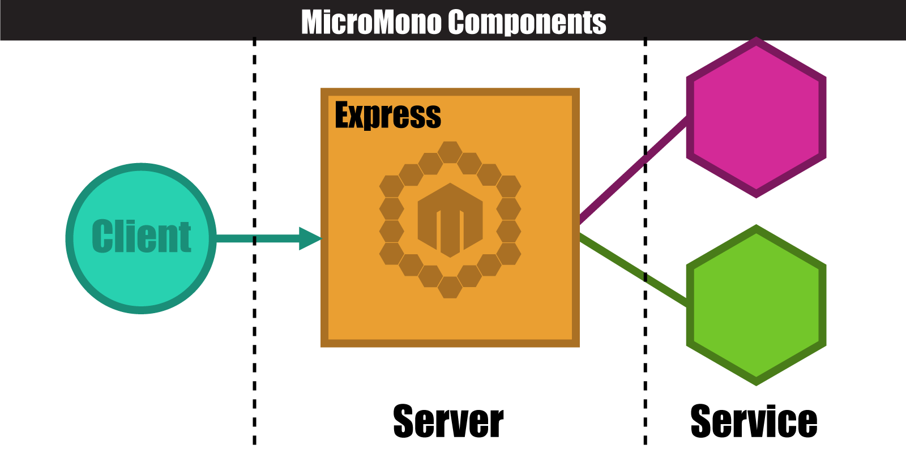
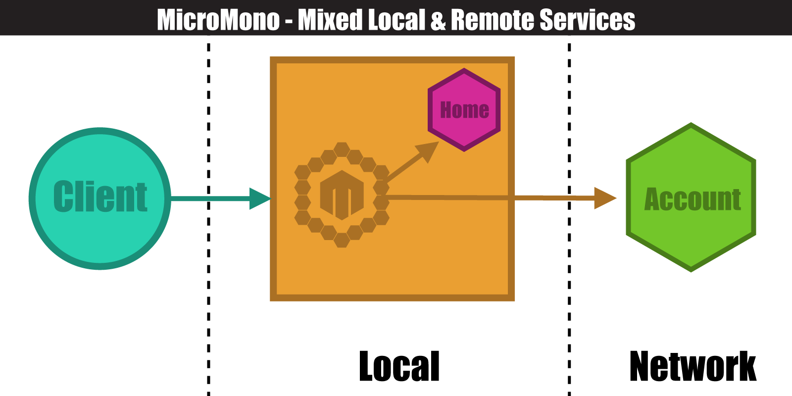
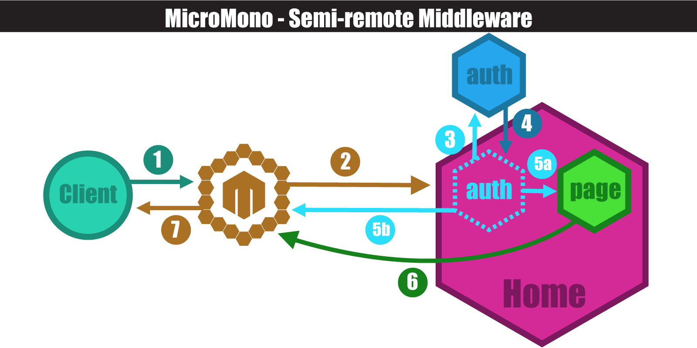
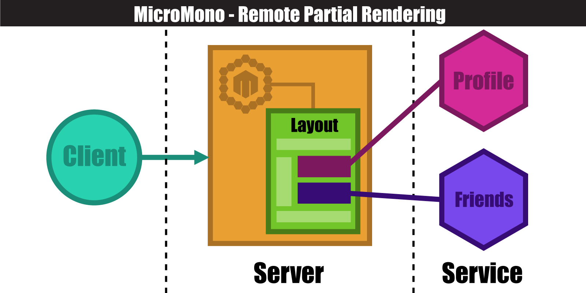
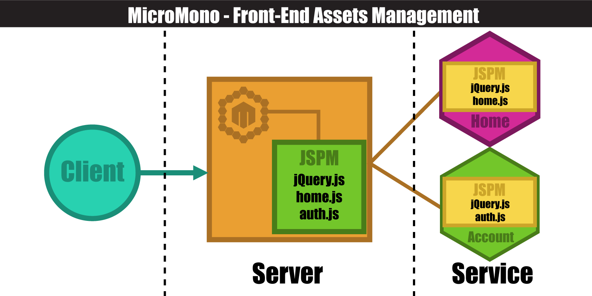

<p align="center">
  
</p>

# MicroMono
[![License MIT][license]](http://opensource.org/licenses/MIT)
[![NPM version][npm-image]][npm-url]
[![Downloads][downloads-image]][npm-url]
[](https://codeclimate.com/github/lsm/micromono)
[](https://gitter.im/lsm/micromono?utm_source=badge&utm_medium=badge&utm_campaign=pr-badge&utm_content=badge)

MicroMono is a framework for developing **micro-services** in **monolithic** style or reversed. It allows you to **switch** and **mix** between micro-service/monolithic styles without changing the code. Before they were two things which always connected with **VS**. Now with **micromono** you have the ability to get the best of both worlds.

## Quick Start

The easiest way to use micromono is to install it through [npm](https://www.npmjs.com/):

`npm install micromono`

There are several demos in the [example folder](https://github.com/lsm/micromono/tree/master/example) to help you get started:

- **account** utilizes passport.js and exposes its authentication features as a service.
- **home** service uses the features provided by `account` service to protect a private page.
- **io** illustrates how to use socket.io (websocket) in your application.

You can simply clone this repository and follow the instruction in the example folder to play them on your own machine. The only requirement is Node.js.

*`Current implementation of micromono is purely in node.js and is still in its early stages.  It uses open standards and has a clearly defined service specification so porting to other languages and platforms is possible and encouraged.  We need your help to make it better.  Any suggestions, pull requests or thoughts are always welcome.  Don't forget to star it on GitHub or share it with others.`*


# Documentation

## Table Of Contents

- [Introduction](#doc_introduction)
- [The Big Picture](#doc_the_big_picture)
  - [Service](#doc_service)
    - [Define A Service](#doc_define_a_service)
    - [Service Initialization](#doc_service_initialization)
    - [Using Other Service](#doc_using_other_service)
    - [Service Adapter](#doc_service_adapter)
  - [Balancer](#doc_balancer)
    - [Using command line](#doc_using_command_line)
    - [With existing application](#doc_with_existing_application)
  - [Local And Remote](#doc_local_and_remote)
- [Web Framework](#doc_web_framework)
  - [Http Routing](#doc_http_routing)
  - [Middleware](#doc_middleware)
    - [Semi-remote Middleware](#doc_semi_remote_middleware)
    - [Fully-remote Middleware](#doc_fully_remote_middleware)
  - [Render Page](#doc_render_page)
  - [Framework Adapter](#doc_framework_adapter)
- [RPC](#doc_rpc)
- [Frontend Scripts Management](#doc_frontend_scripts_management)
- [Design](#doc_design)
  - [Service Announcement Specification](#doc_service_announcement_specification)


<a name="doc_introduction"></a>
## Introduction

Monolithic structure is easy to understand and develop. Because, that is the way how we think when we are designing. But, it becomes a different story when it has more and more features or you want to deploy it to serve hundreds of thousands of users. Then there's micro-services architecture. It [has many benefits](http://eugenedvorkin.com/seven-micro-services-architecture-advantages/) in [different ways](http://damianm.com/articles/human-benefits-of-a-microservice-architecture/).  It becomes increasingly easier and more practical to apply these days due to the widely adopted container virtualization technologies (e.g. Docker & its ecosystem). But, the micro-services approach is also a [double-edged sword](http://martinfowler.com/articles/microservice-trade-offs.html) and it is of course [not a free lunch](http://highscalability.com/blog/2014/4/8/microservices-not-a-free-lunch.html).  Sometimes you have to rewrite the entire application to meet the requirements of the new architecture.  Unfortunately, even with the rewrite, the application may not be as elegant and efficient as desired due to the complexity and the costs spiraling out of control.  **Micromono's goal is to provide you the flexibility to choose the trade-offs for different circumstances so you could enjoy the best of both worlds.**


<a name="doc_the_big_picture"></a>
## The Big Picture

MicroMono involves 3 parts of application development:

- **Web framework** (http routing, middleware, page rendering etc.)
- **Remote procedure calls** (RPC)
- **Front-end code management** (static asset files of javacript/css).

Sounds familiar, right? MicroMono is built with proven, open source frameworks and libraries (e.g. [express](http://expressjs.org) and [JSPM](http://jspm.io/)).  You will find yourself right at home when working with MicroMono if you have ever used any of these tools before.

In MicroMono, there are 2 different types of components:

- **[Balancer](#doc_balancer)** serves requests directly from clients and proxies requests to the right services behind it.
- **[Service](#doc_service)** runs the code which provide the actual feature.

<a name="#doc_service"></a>
### Service

A service is a standalone package which groups related features together as an unit. It could have only one RPC endpoint, or it may have a http routing code and client side dependencies. You can think of it as a **micro-monolithic application** with everything you need to run that part of the business logic.  In current node.js implementation it is also a npm package. So in the `package.json` file you can define npm dependencies as well as the required libraries for client-side code. But, this doesn't mean that you have to write your services in node.js. We will cover more about this topic in the [design section](#doc_design).

<a name="doc_define_a_service"></a>
#### Define A Service

Here's an example that shows how to define a simple service which handles http request/response.

```javascript
// Require micromono and get the Service base class
var Service = require('micromono').Service;

// Subclass Service class to define your service
// (Backbone/Ampersand style inheritance)
var SimpleHttpService = Service.extend({
  // `route` is the object where you define all your routing handlers
  route: {
    'get::/hello/:name': function(req, res) {
      // Basically, this handler function will be directly attached to
      // internal express instance created by micromono. So, any express
      // route handler could be ported to micromono without any modification.
      var name = req.params.name;
      res.send('Hello, ' + name);
    }
  }
});
```

The `'get::/hello/:name': function(req, res){...}` part in above example equivalents to:

```javascript
var app = express();
app.get('/hello/:name', function(req, res){
  var name = req.params.name;
  res.send('Hello, ' + name);
});
```

For more detailed information about http routing, middleware or page rendering please go to [Web Framework](#doc_web_framework).

<a name="doc_service_initialization"></a>
#### Service Initialization

Each service could have an initialization function `init`. You can do some preparation works here. For example, connect to database or setup internal express server. The `init` function takes no arguments and an instance of `Promise` could to be returned if have async operation in initialization. You need to resolve the returned `Promise` after the work has been done or reject it if there's an error. Let's see an example:

```javascript
var bodyParser = require('body-parser');
var Service = require('micromono').Service;
var MongoClient = require('mongodb').MongoClient;

module.exports = Service.extend({
  // initialization function takes no arguments
  init: function() {
    // get the internal express instance
    var app = this.app;
    // use a middleware
    app.use(bodyParser.json());

    var self = this;
    // create a new promise instance
    var promise = new Promise(function(resolve, reject){
      // do the async operation (connect)
      MongoClient.connect('127.0.0.1', function(err, db){
        if (err) {
          // reject the promise if there's an error
          reject(err);
          return;
        }
        self.db = db;
        // resolve when done
        resolve();
      });
    });
    // init function should return a promise no matter what
    return promise;
  }
});
```

<a name="doc_service_adapter"></a>
#### Service Adapter

By default micromono uses expressjs to handle the web request, uses socket.io for RPC communication. But, people may have different opinions and everyone could be right even they have different preferences. Because, each combination of developers/teams/products is unique and the best choice is always the one that most *"fit"*. That's why we always put flexibility as a high priority factor being considered when designing micromono. We will cover more about this in [Web Framework Adapter](#doc_framework_adapter) and [RPC Adapter](#doc_rpc_adapter).

<a name="doc_balancer"></a>
### Balancer

Balancer sits in front of all services which actually glues all the services together and boots up a **server** to serve requests directly from clients. You can use the command line command `micromono` to start up a balancer if you use micromono exclusively. Or you can have micromono running cohesively within your existing server by adding a few lines of code.

<a name="doc_using_command_line"></a>
#### Using command line

First we need to install micromono globally:

`npm install -g micromono`

Then go to terminal and run:

`micromono --service service1 --service-dir ./services`

This tells micromono to start the balancer with `service1` and try to find the service in a local directory called `services`. If micromono failed to find the service from local machine it will try to find a service provider from local network. We will discuss more about running [Local And Remote](#doc_local_and_remote) services later.

<a name="doc_with_existing_application"></a>
#### With existing application

The server code is very simple and straight forward. Below is an example shows how to use micromono together with express server.

```javascript
// Require micromono and call to get an instance
var micromono = require('micromono')();

// Require the services you need.
// In this step, micromono will attempt to locate the required package on your local machine.
// If it fails it will try to probe from the network.
micromono.require('home');
micromono.require('account');

// Create an express instance
// We don't alter the express instance, so you can do what ever you want
// to the express instance and they will work as expected.
var app = require('express')();

// start balancer with the express app
micromono.runBalancer(app).then(function(){
    // start serving requests
    app.listen(3000);
});
```

<a name="doc_local_and_remote"></a>
## Local And Remote



As we mentioned at the beginning. The pros and cons of micro-services architecture are obvious and have been widely discussed. MicroMono allows you to **choose the right trade-offs for the right scenario**. If you application has 10 services, you may run all the 10 services on your local dev machine. Or run 1 service which you are developing locally and use the rest 9 of them (stable/finished services) remotely through network. Having a completely different setup for deployment or testing services in parallel? Imagination is your only limitation. The most critical thing is **being able to use any services locally or remotely without knowing the difference or changing the code**. MicroMono gives you this ability by rebuilding the exact service class based on service announcement. This is the most important feature MicroMono brings to the table and you won't feel it as MicroMono does the job behind the scenes. It is true no matter what you are dealing with: http request, RPC or front-end scripts.


<a name="doc_web_framework"></a>
## Web Framework

MicroMono wraps a thin layer on top of the other frameworks (express by default). So, existing applications of supported frameworks should be able to easily be ported without any problems.  In this section we will go through 3 topics to understand the web framework part of MicroMono: **[http routing](#doc_http_routing)**, **[middleware](#doc_middleware)** and **[page rendering](#doc_render_page)**.

<a name="doc_http_routing"></a>
### Http routing

As you can see in the earlier example. You could define http routing handlers by putting the definition in the 'route' object property when you extend the 'Service' with following format:

```javascript
route: {
  '[http method]::[matching string]': '[request handler function or array]',
  ...
}
```

- **object key** defines the http method and matching string separated with double colons.
- **value** could be a function which will be the handler of the path. Or array of functions which contains middleware functions as well as route handler.

Actually you want read more documentation of the framework being used to get better understanding of how routing works as micromono basically maps the definition directly to the underlying framework. Here is an example of using connect style middleware for a particular route:

```javascript
var bodyParser = require('body-parser');
var Service = require('micromono').Service;

module.exports = Service.extend({
  route: {
    // parse form data only for this path
    'post::/update':[bodyParser.urlencoded(), function(req, res){
      var body = req.body;
      // do something with body
      ...
    }]
  }
});
```
<a name="doc_middleware"></a>
### Middleware

Normally, middleware is just piece of code which can be plugged-in into your routing system to modify the http request or response stream on the fly. In detail, there are 4 things you can alter:

- Request header (meta)
- Request body (stream)
- Response header (meta)
- Response body (stream)

Some middleware may modify all 4 of them, some may change 1 and some just need the information and do nothing (e.g. logging). Most middleware works fine locally, as they are just some code and don't require external/remote resources. But, some of them you may want to run remotely as services, due to the complexity of the configuration. In MicroMono in order to support remote middleware we separate them into 2 categories: **Semi-remote** and  **Fully-remote** middleware services.

*`Note: When we are talking about remote middleware we mean the ability to use that middleware remotely as a service. Which means you still can use them locally as any other normal middleware you have.`*

<a name="doc_semi_remote_middleware"></a>
#### Semi-remote middleware

Semi-remote middleware modifies only the meta info of request/response or takes over the control of request/response completely. Authentication middleware would be a perfect example of this scenario. Let's take a closer look at the whole authentication process:

1. Auth middleware gets the request
2. Check if we can get/verify user info from the request data:

  2.1 Auth successfully, add user info to request and let the request keep going to the next middleware or routing handler.

  2.2 Auth failed, redirect request to a designated location (e.g. login page)

As we can see, if auth successfully the response stream of routing handler could be sent directly back to the client without going through the auth middleware. Or, the response from auth middleware would be sufficient to send to client without touching any other middleware or routing handler in the case of failure authentication. In MicroMono the above semi-remote authentication middleware works like this:



1. MicroMono server gets the request from client.
2. Proxy the request to right service.
3. Service gets the request and proxy the request to remote middleware.
4. Remote middleware does the work and responses to the service.
5. Depends on the response of remote middleware:

  5a. Request will be modified and will be passed to the next handler.

  5b. Response data from middleware will be sent back to the client directly and the original request will not go any further.

6. The route handler gets the requests and sends response back to micromono server.
7. Server gets the response and sends back to the client.

Please check out [example/account](https://github.com/lsm/micromono/tree/master/example/account) and [example/home](https://github.com/lsm/micromono/tree/master/example/home) to learn how to make and use a semi-remote middleware.

<a name="doc_fully_remote_middleware"></a>
#### Fully-remote middleware

Fully-remote middleware is a normal middleware which requires the request/response data stream go through it during the entire life cycle. MicroMono only supports running fully-remote middleware in the balancer server. Service need to define which middleware to use by using the `use` property:

```javascript

var MyService = module.exports = Service.extend({
  packagePath: __dirname,
  baseUrl: '/myservice',
  use: {
    // tell micromono to use `layout` middleware at the balancer side
    // for request which matches url `/myservice/dashboard` (baseUrl + routeUrl).
    'layout': '/dashboard'
  },

  route: {
    '/dashboard': function (req, res) {
      // a template partial called `dashboard_tpl` will be rendered
      // and the result will be composed by `layout` middleware to generate the final page
      res.render('dashboard_tpl');
    }
  }
});

```

Having any kind of remote middleware will of course slow down the performance dramatically, but sometimes it's worth it, to reduce the complexity of deployment and provide a more modularized architecture. MicroMono is focused on giving you the most flexibility while allowing you to choose the trade-offs.

<a name="doc_render_page"></a>
### Render Page

Page rendering is a common task for web framework and you will probably need some kind of template reuse if your application has multiple pages. A typical case is header, footer and layout templates which are shared among pages and each page only provides the different part. But, think about what we should do if these pages are rendered by different services which are not physically located on a same machine. A simple way is to have a copy of the shared template files for each service deployed. Or we can use the built-in middleware [layout](https://github.com/lsm/micromono/tree/master/lib/middleware/layout.js) to compose the contents of each page with shared templates:



```javascript

var Profile = module.exports = Service.extend({
  packagePath: __dirname,
  baseUrl: '/',

  use: {
    // tell micromono to use `layout` middleware at the balancer side
    // for request which matches following urls in the array.
    'layout': ['/profile', '/$']
  },

  route: {

    '/': function(req, res) {
      // response will be re-rendered by `layout` middleware in the balancer process
    },

    'get::/profile': function (req, res) {
      // response will be re-rendered by `layout` middleware in the balancer process
    },

    'post::/upload': function (req, res) {
      // this will not be touched by `layout` as it doesn't match the url
    }
  }
});
```

<a name="doc_rpc"></a>
## RPC


<a name="doc_frontend_scripts_management"></a>
## Frontend Scripts Management



## Discuss

On hacker news: https://news.ycombinator.com/item?id=10157418

## License

MIT


[npm-url]: https://npmjs.org/package/micromono
[npm-image]: http://img.shields.io/npm/v/micromono.svg
[license]: https://img.shields.io/npm/l/micromono.svg
[downloads-image]: http://img.shields.io/npm/dm/micromono.svg
