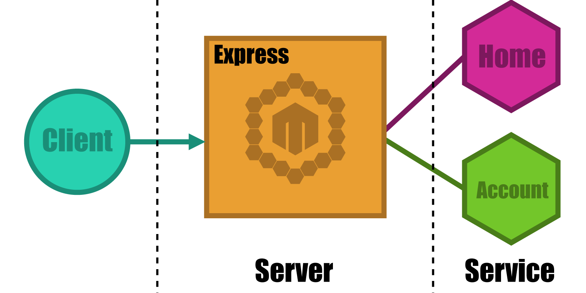

<p align="center">
  
</p>

# MicroMono
[](https://gitter.im/lsm/micromono?utm_source=badge&utm_medium=badge&utm_campaign=pr-badge&utm_content=badge)

MicroMono is a tool that allows you to develop giant, monolithic application in micro-service style.  It can also convert existing applications with very little effort. More accurately, it allows people to separate features into **micro-monolithic services/components/apps** and run them together as **a single system** transparently, just as before.  The micro-services architecture itself [has many benefits](http://eugenedvorkin.com/seven-micro-services-architecture-advantages/) in [different ways](http://damianm.com/articles/human-benefits-of-a-microservice-architecture/).  It becomes increasingly easier and more practical to apply these days due to the widely adopted container virtuallization technologies (e.g. Docker & its ecosystem). But, the micro-services approach is also a [double-edged sword](http://martinfowler.com/articles/microservice-trade-offs.html) and it is of course [not a free lunch](http://highscalability.com/blog/2014/4/8/microservices-not-a-free-lunch.html).  Sometimes you have to rewrite the entire application to meet the requirements of the new architecture.  Unfortunately, even with the rewrite, the application may not be as elegant and efficient as desired due to the complexity and the costs spiraling out of control.  Micromono's goal is to let you enjoy all the benefits of micro-services while keeping you away from the other edge of the sword.

*Current implementation of micromono is purely in node.js and is still in its early stages.  We need your help to make it better.  So any suggestions, pull requests or thoughts (design, other languages etc.) are always welcome.  Don't forget to star it on GitHub or share it with others who might be interested.*

# How it works

Micromono involves 3 major parts of application development at this time:

- **Web framework** (http routing, middleware, page rendering etc.)
- **Remote procedure calls** (RPC)
- **Front-end code management** (static asset files of javacript/css).

Sounds familiar, right? Micromono is built with proven, open source frameworks and libraries.  You will find yourself right at home when working with MicroMono if you have ever used any of these tools before.

## Two Components

In MicroMono, you will generally have 2 different types of components:
    - **Server** serves requests directly from clients and proxies them to the services behind it.
    - **Service** runs the code which provide the actual feature.




### Service


A service could have only one RPC endpoint, or it may have a http routing code and client side dependencies. You can think of it as a micro application with everything you need to run that part of the business logic. In current node.js implementation it is also a npm package. So in the `package.json` file you can define npm depedencies as well as the required libraries for client-side code. But, this doesn't mean that you have to write your services in node.js. We will cover more about this topic in section [Development in other languages]().

Here's an example that shows how to define a simple service which handles http request/response.

```javascript
// Require micromono and get the Service base class
var Service = require('micromono').Service;

// Subclass Service class to define your service
// (Backbone/Ampersand style inheritance)
var SimpleHttpService = Service.extend({
  // `route` is the object where you define all your routing handlers
  route: {
    'get::/hello/:name': function(req, res) {
      // Basically, this handler function will be directly attached to
      // internal express instance created by micromono. So, any express
      // route handler could be ported to micromono without any modification.
      var name = req.params.name;
      res.send('Hello, ' + name);
    }
  }
});
```

The `'get::/hello/:name': function(req, res){...}` equivalents to:

```javascript
var app = express();
app.get('/hello/:name', function(req, res){
  var name = req.params.name;
  res.send('Hello, ' + name);
});
```

For more detailed information about http routing, middleware or page rendering please go to [Web framework](#web-framework).


### Server

The second type is the part which actually glues all the services together and boots up a **server** to serve requests directly from clients.

The **server** code is very simple and straight forward. With a few changes you can have MicroMono running cohesively within your existing express server.

```javascript
// Require micromono and call to get an instance
var micromono = require('micromono')();

// Require services you need
// In this step, micromono will attempt to locate the required package on your local machine.
// If it fails it will try to probe from the network.
micromono.require('home');
micromono.require('account');

// Create an express instance
// We don't alter the express instance, so you can do what ever you want
// to the express instance and they will work as expected.
var app = require('express')();

// boot micromono with the express app
micromono.boot(app).then(function(){
    // start serving requests
    app.listen(3000);
});
```

## Web framework

MicroMono wraps a thin layer on top of the express framework.  So, existing express applications should be able to easily be ported without any problems.  In this section we will go through 3 topics to understand the web framework part of MicroMono: http routing, middleware and page rendering.

### Http routing

As you can see in the earlier example. You could define http routing handlers by putting the definition in the 'route' object property when you extend the 'Service'. In the route object:
- key defines the http method and matching string separated with double colons.
- value could be a function which will be the handler of the path. Or array of functions which contains middleware functions as well as route handler.

The format is:

  `'[http method]::[matching string]': '[request handler function or array]'`
